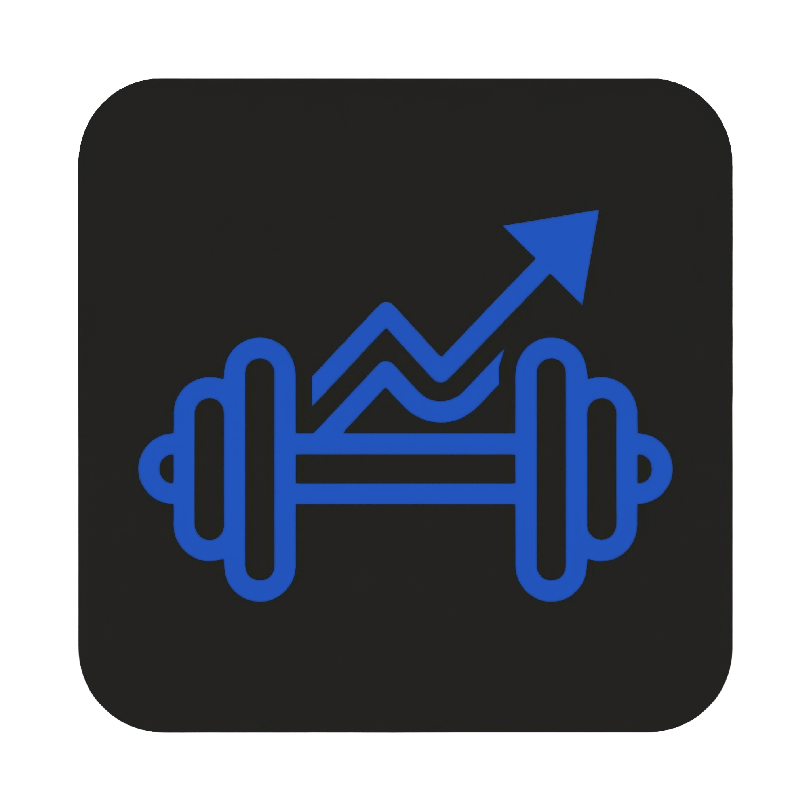
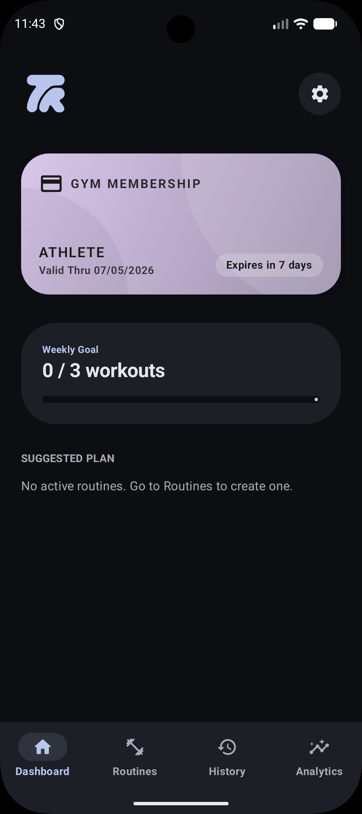
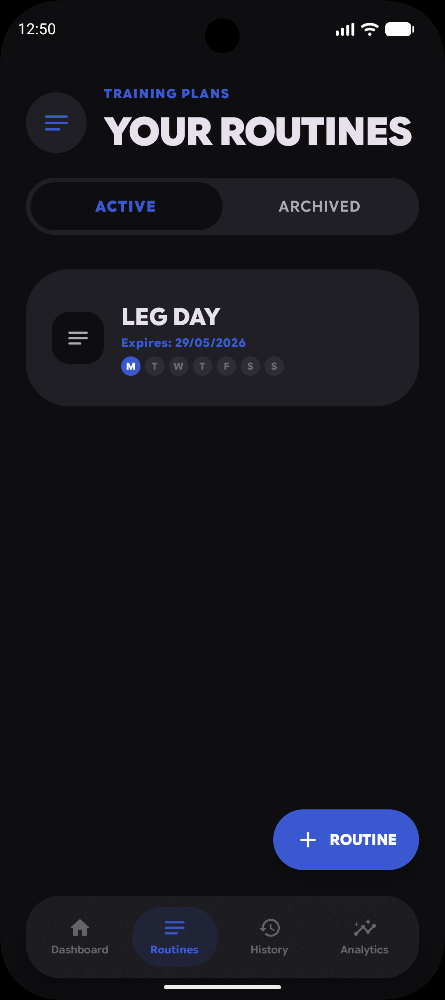
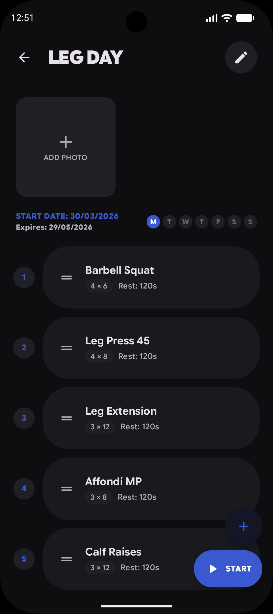
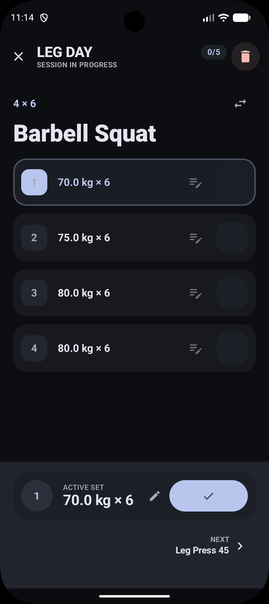
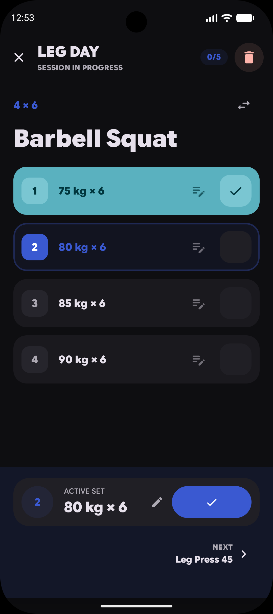

<div align="center">
  

  # Trainable
</div>

[](https://developer.android.com/)
[](https://kotlinlang.org/)
[](https://developer.android.com/jetpack/compose)
[](https://m3.material.io/)
[](https://github.com/Emanuel5014/Trainable/releases/latest)

<div align="center">
  <br>
  <a href="https://github.com/Emanuel5014/Trainable/releases/latest/download/Trainable.apk">
    
  </a>
</div>


**Trainable** is a premium, native Android workout tracker designed for lifters. It focuses on a "Monolithic" dark-only aesthetic, perfectly aligned with Google's **Material 3 Expressive** guidelines, offering a seamless experience specifically optimized for Pixel devices.
---
## 📱 Screenshots

<div align="center">
  
  
  
  
  
  
</div>


## ✨ Features

### 📊 Intelligent Dashboard
*   **Active Plan Hub**: Quick access to your current routine and next scheduled session.
*   **Resume Workout**: Smart hub to quickly resume interrupted sessions without data loss.

### 📋 Advanced Routine Builder
*   **Exercise Library**: 130+ pre-populated exercises with categorized filters.
*   **Drag & Drop Reordering**: Fluid, haptic-powered reordering of exercises within routines.
*   **Custom Exercises**: Add and manage your own exercises with persistent categorization.

### 💪 High-Performance Workout Execution
*   **Expressive UI**: Massive, touch-friendly inputs designed for use during heavy sets.
*   **Wheel Pickers**: Haptic-boosted weight and rep selection for precise control.
*   **Smart Hub**: Dynamic navigation between exercises with "Finish" and "Next" logic.
*   **Rest Timer**: Integrated countdown cards that respect your focus.
*   **Session Notes**: Persistence of notes for every single set for granular tracking.

### 📈 Deep Analytics
*   **Vico Charts**: Professional-grade visualizations for total volume and strength trends.
*   **Consistency Tracking**: Visual heatmaps and progress cards.
*   **Strength Index**: Algorithmic assessment of your structural balance and performance.
*   **Body Composition**: Integrated weight logging and body fat tracking.

### ⚙️ Premium UX & Tools
*   **Dynamic Color**: Full support for Android 12+ wallpaper-based color extraction.
*   **Horizontal Pager Navigation**: Fluid swipe-based transitions between main tabs.
*   **Backup & Restore**: Secure ZIP-based local backup system for your database.
*   **Tactile Feedback**: Enhanced haptic responses for all critical UI interactions.

---

## 🏗️ Technical Architecture

Trainable follows **Clean Architecture** principles combined with **MVVM** for a robust and testable codebase:

*   **UI Layer**: 100% Jetpack Compose using the **Monolithic Design System** (no XML).
*   **Presentation Layer**: Hilt-injected ViewModels managing `StateFlow` for reactive UI updates.
*   **Data Layer**: 
    *   **Room Database**: Single Source of Truth (SSoT).
    *   **DataStore**: For lightweight user preferences (Haptic settings, theme).
    *   **WorkManager**: Automated background backups.
*   **Navigation**: Type-safe navigation with `@Serializable` routes.


---

## 🚀 Getting Started

### Prerequisites
*   Android Studio Ladybug or newer.
*   Android SDK 28 or higher.
*   A device/emulator running Android 12+ (for Dynamic Color support).

### Setup
1.  Clone the repository:
    ```bash
    git clone https://github.com/Emanuel5014/Trainable.git
    ```
2.  Open the project in Android Studio.
3.  Build and Run on your device.

---

## 🛠️ Tech Stack
*   **Language**: Kotlin (1.9.x)
*   **UI**: Jetpack Compose (1.6.x)
*   **Dependency Injection**: Dagger Hilt
*   **Database**: Room (with KSP)
*   **Charts**: Vico
*   **Serialization**: Kotlinx Serialization
*   **Concurrency**: Kotlin Coroutines & Flow

---

*Developed with ❤️ by Emanuel5014.*
