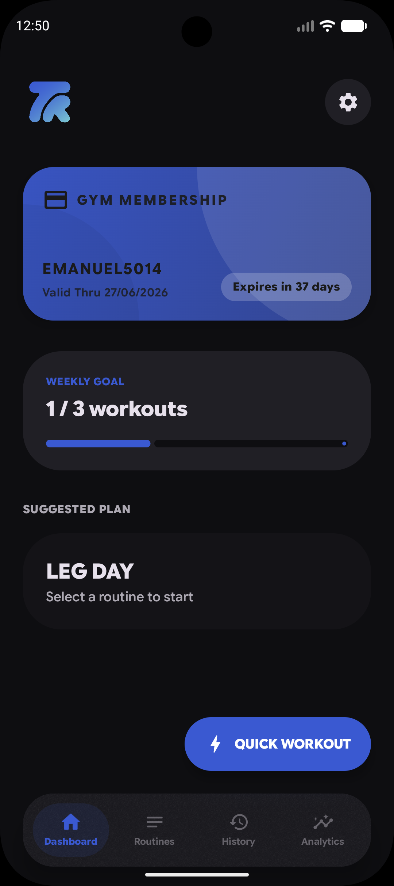
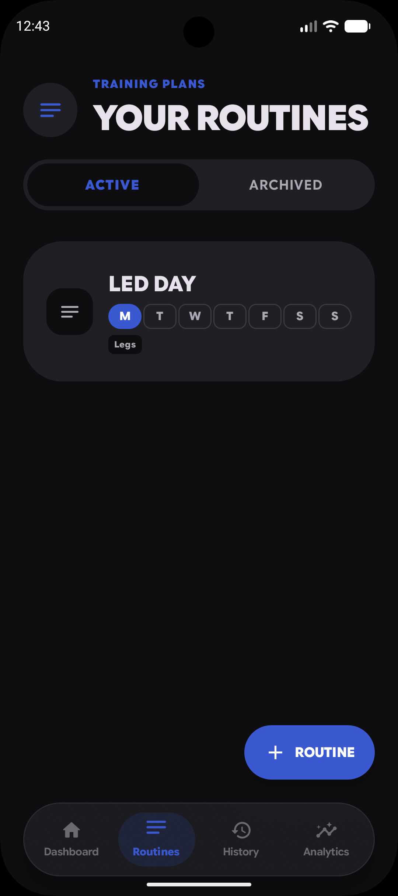
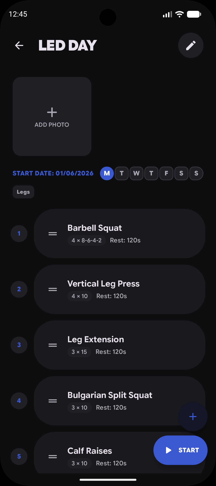
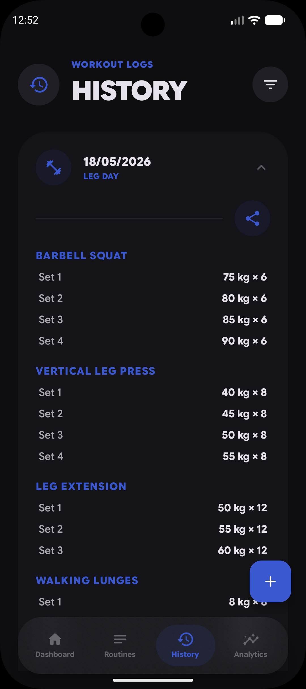
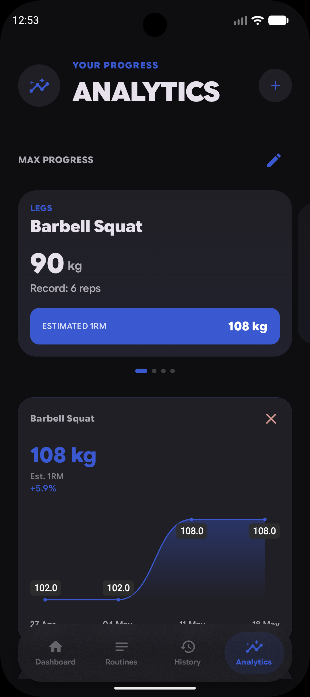

<div align="center">
  

  # Trainable
  <sub>Logo by br1_production</sub>
</div>

[](https://developer.android.com/)
[](https://kotlinlang.org/)
[](https://developer.android.com/jetpack/compose)
[](https://m3.material.io/)
[](https://github.com/Emanuel5014/Trainable/releases/latest)
[](https://github.com/Emanuel5014/Trainable/stargazers)
[](https://ko-fi.com/emanuel5014)
[](https://trainableapp.vercel.app)

<div align="center">
  <br>
  <a href="https://github.com/Emanuel5014/Trainable/releases/latest/download/Trainable.apk">
    
  </a>
</div>


**Trainable** is a premium, native Android workout tracker designed for lifters. It features a monolithic design aligned with Google's **Material 3 Expressive** guidelines, with both **Dark** and **Light Mode** support, offering a seamless experience optimized for Pixel devices.

Available in **6 languages**: English, Italian, Portuguese, German, French, Spanish.

---

## 📱 Screenshots

<div align="center">
  
  
  
  
  
  
</div>


## ✨ Features

### 📊 Intelligent Dashboard
*   **Active Plan Hub**: Quick access to your current routine and next scheduled session.
*   **Smart Recommendations**: Assign routines to specific weekdays for intelligent "Today's Workout" suggestions.
*   **Resume Workout**: Smart hub to quickly resume interrupted sessions without data loss.
*   **Quick Start**: Start an empty workout directly from the dashboard without a plan.

### 📋 Advanced Routine Builder
*   **Exercise Library**: 130+ pre-populated exercises with categorized filters.
*   **Drag & Drop Reordering**: Fluid, haptic-powered reordering of exercises within routines.
*   **Custom Exercises**: Add and manage your own exercises with persistent categorization.
*   **Superset Support**: Group exercises into supersets within routines.
*   **Plan Scheduling**: Set Start and Expire dates when creating or editing routines.
*   **Routine Sharing**: Export and import routines via `.trainableplan` file format.
*   **Routine Photos**: Capture multiple photos in-app and include them in exports.

### 💪 High-Performance Workout Execution
*   **Expressive UI**: Massive, touch-friendly inputs designed for use during heavy sets.
*   **Wheel Pickers**: Haptic-boosted weight and rep selection for precise control.
*   **Smart Hub**: Dynamic navigation between exercises with "Finish" and "Next" logic.
*   **Superset Flow**: Execute grouped superset exercises seamlessly.
*   **Rest Timer**: Integrated countdown cards with enhanced notifications showing next-set details and planned reps.
*   **Warmup Timer**: Configurable warmup timer in settings.
*   **Session Notes**: Persistence of notes for every single set for granular tracking.
*   **Swipe Navigation**: Swipe between exercises during workout execution.
*   **Exercise Note Pre-fill**: Auto-fill exercise notes from session history.
*   **On-the-fly Edits**: Add custom exercises mid-workout; tap plan title to view/edit plan details.

### 📈 Deep Analytics
*   **Vico Charts**: Professional-grade visualizations for total volume and strength trends.
*   **1RM Tracking**: Algorithmic strength assessment using the Epley formula, with optional 1RM cards.
*   **Volume by Muscle Group**: Track volume distributed across muscle groups.
*   **Session Comparison**: Compare workouts across time periods or specific sessions.
*   **Workout Calendar**: Visual calendar widget for workout frequency.
*   **Consistency Tracking**: Visual heatmaps and progress cards.
*   **Strength Index**: Algorithmic assessment of your structural balance and performance.
*   **Body Weight**: Integrated weight logging and history tracking.
*   **Body Weight History**: Dedicated module with date picker, delete functionality, and collapsible UI.
*   **Cardio Tracking**: Cardio counter in weekly goal overview.

### 🌍 Localization
*   **6 Languages**: English, Italian, Portuguese, German, French, Spanish.
*   **Dynamic Switching**: Change language directly from Settings.

### 🏟️ Gym Membership
*   **Expiration Tracking**: Monitor your gym subscription end date.
*   **Smart Alerts**: Expiration notifications with "Renew" quick action buttons.

### 📸 Social Sharing
*   **Workout Share Cards**: Generate and share full-length workout summary images.
*   **Live Preview**: Preview your share card before sharing.
*   **Muscle Group Details**: Muscle group breakdown included in share cards.
*   **Session Notes**: Workout notes included in shared summaries.
*   **Planned Set/Rep Scheme**: Planned set and rep structure included in share cards.

### 📱 Widgets
*   **Quick Start/Resume Widget**: Home Screen and Lock Screen widget for instant workout start or resume.
*   **Weekly Goal Widget**: Track weekly workout goal progress directly from your home screen.

### 🔒 Physical Checks
*   **Hidden Entry Point**: Tap the Trainable logo 3 times from the Dashboard to access Physical Checks.
*   **Body Progression Tracking**: Log body measurements with weight, notes, and timestamp.
*   **Photo Gallery**: Capture or import multiple photos per check with fullscreen pinch-to-zoom viewer.
*   **Before/After Comparison**: Interactive slider overlay to compare any two check entries.
*   **Biometric Lock**: Fingerprint or device PIN gate for quick access.
*   **Password Encryption**: Optional AES-256-GCM password-based encryption for all check photos.
*   **Forgot Password Reset**: Secure nuclear reset that deletes all check data if password is lost.
*   **Auto-Lock**: Session auto-locks after inactivity or when app goes to background.
*   **Unit Conversion**: Automatic kg/lb conversion for weight entries.
*   **Swipe & Long-Press Actions**: Quick edit, delete, and manage checks via gestures.

### ⚙️ Premium UX & Tools
*   **Dynamic Color**: Full support for Android 12+ wallpaper-based color extraction.
*   **Light Mode & Custom Themes**: Switch between Dark/Light mode, customize themes, and choose from an extensive color palette in Settings.
*   **Google Sans Font**: Clean, modern typography throughout the app.
*   **Horizontal Pager Navigation**: Fluid swipe-based transitions between main tabs.
*   **Backup & Restore**: Secure ZIP-based local backup system with photo compression and expanded preference sync (Theme, Units, Language).
*   **Auto-Backup**: Reliable WorkManager-based automated background backups.
*   **Tactile Feedback**: Enhanced haptic responses for all critical UI interactions.
*   **Interaction Choice**: Configure Swipe or Long-press interaction style in Settings.
*   **Auto-Updates**: Built-in automatic update support for future releases.
*   **Unit System**: Choose between Metric (kg) and Imperial (lbs).

---

## 🏗️ Technical Architecture

Trainable follows **Clean Architecture** principles combined with **MVVM** for a robust and testable codebase:

*   **UI Layer**: 100% Jetpack Compose using the **Monolithic Design System** (no XML).
*   **Presentation Layer**: Hilt-injected ViewModels managing `StateFlow` for reactive UI updates.
*   **Data Layer**: 
    *   **Room Database**: Single Source of Truth (SSoT).
    *   **DataStore**: For lightweight user preferences (Haptic settings, theme).
    *   **WorkManager**: Automated background backups.
*   **Navigation**: Type-safe navigation with `@Serializable` routes.


---

## 📁 Project Structure

```
com/emanuel5014/trainable/
├── data/
│   ├── local/
│   │   ├── dao/            # Room DAOs (WorkoutDao, ExerciseDao, PhysicalCheckDao)
│   │   ├── entity/         # Room entities (SetLogEntity, WorkoutPlanEntity, PhysicalCheckEntity)
│   │   └── relation/       # Relation classes (PlanWithDetails, SessionWithSets, etc.)
│   ├── remote/
│   │   └── dto/            # DTOs for export/import (WorkoutPlanExportDto)
│   └── repository/         # Repositories (WorkoutRepository, AnalyticsRepository, PhysicalCheckRepository)
├── di/                     # Hilt modules (DatabaseModule, NetworkModule)
├── ui/
│   ├── components/
│   │   ├── analytics/      # Charts, stat cards, consistency, body comp, etc.
│   │   ├── base/           # Design system primitives (GymCard, GymButton, etc.)
│   │   ├── dialogs/        # Reusable dialogs (UpdateDialog, ImportConfirmation)
│   │   ├── exercise/       # Exercise cards, picker, rest timer, set log input
│   │   ├── navbar/         # Bottom navigation bar and items
│   │   └── shared/         # Shared utilities (EmptyState, SwipeableCard, etc.)
│   ├── navigation/         # NavGraph, Routes
│   ├── screens/
│   │   ├── analytics/      # Analytics dashboard, drag-drop state
│   │   ├── compare/        # Session comparison
│   │   ├── dashboard/      # Main dashboard
│   │   ├── history/        # Session history, edit, filter
│   │   ├── onboarding/     # Onboarding flow
│   │   ├── physicalcheck/  # Physical checks (body progression with photos & encryption)
│   │   ├── routines/       # Routine list, detail, builder
│   │   ├── settings/       # App settings
│   │   └── workout/        # Workout execution
│   ├── theme/              # Color, Shape, Type, Spacing, Theme
│   └── util/               # DateFormatter
├── util/
│   ├── backup/             # AutoBackupWorker, BackupManager
│   └── notification/       # TimerNotification, GymMembershipWorker
├── widget/                 # Glance widgets (TrainableWidget, WeeklyGoalWidget)
├── MainActivity.kt
└── GymTrackingApp.kt
```


## 🚀 Getting Started

### Prerequisites
*   Android Studio Ladybug or newer.
*   Android SDK 28 or higher.
*   A device/emulator running Android 12+ (for Dynamic Color support).

### Setup
1.  Clone the repository:
    ```bash
    git clone https://github.com/Emanuel5014/Trainable.git
    ```
2.  Open the project in Android Studio.
3.  Build and Run on your device.

---

## 🛠️ Tech Stack
*   **Language**: Kotlin (2.3.x)
*   **UI**: Jetpack Compose (2026.x) with Material3 (1.5.x)
*   **Dependency Injection**: Dagger Hilt (2.59.x)
*   **Database**: Room (2.8.x) with KSP
*   **Charts**: Vico (2.1.x)
*   **Serialization**: Kotlinx Serialization (1.11.x)
*   **Navigation**: Navigation Compose (2.9.x)
*   **Concurrency**: Kotlin Coroutines & Flow
*   **Preferences**: DataStore Preferences (1.2.x)
*   **Background Tasks**: WorkManager (2.11.x)
*   **Image Loading**: Coil (2.7.x)
*   **Build**: Gradle (9.4.x) + AGP (9.2.x)

---

## ❤️ Support the project

If you find this project useful, please consider giving it a ⭐ on GitHub or supporting development via Ko-fi!

<div align="center">
  <a href="https://ko-fi.com/emanuel5014" target="_blank">
    
  </a>
</div>

---

*Developed with ❤️ by Emanuel5014.*
